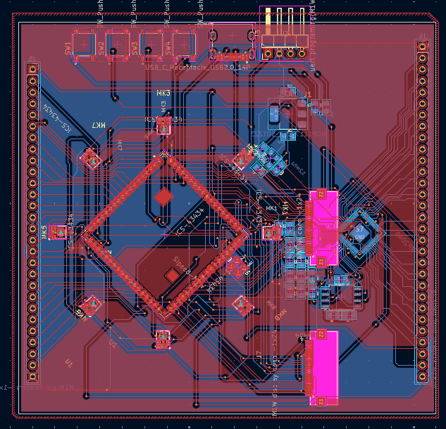
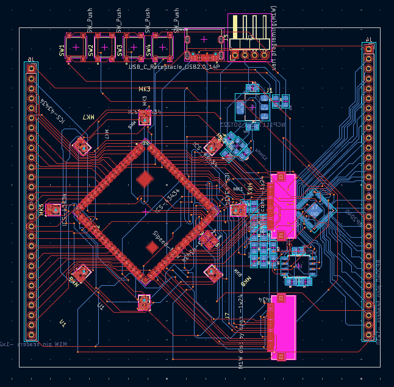
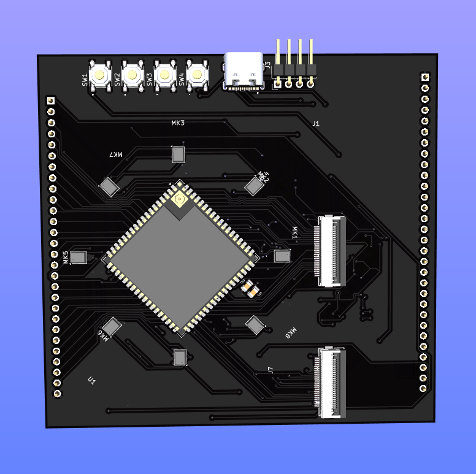
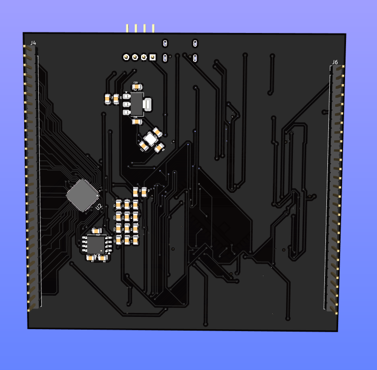
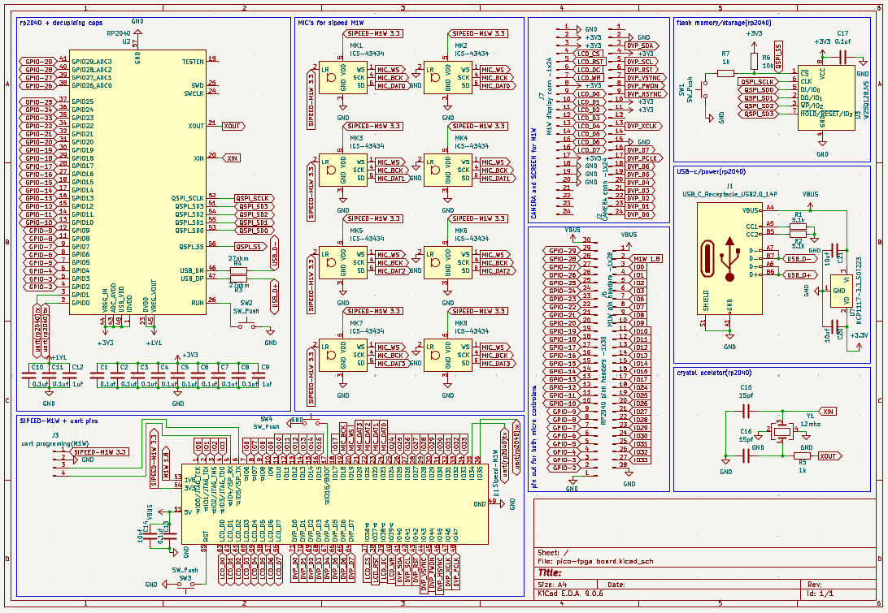

# rp2040-sipeed-M1W-dev-board

*the names of the PCB files are different cause at the very start i sightly chnaged what i was doing and didnt know how to change kicad project names*

a rp2040 and a sippeed M1W on one board both connected by uart the M1W has a camera and lcd connector aswell as 8 mics in a circle for directional detection

